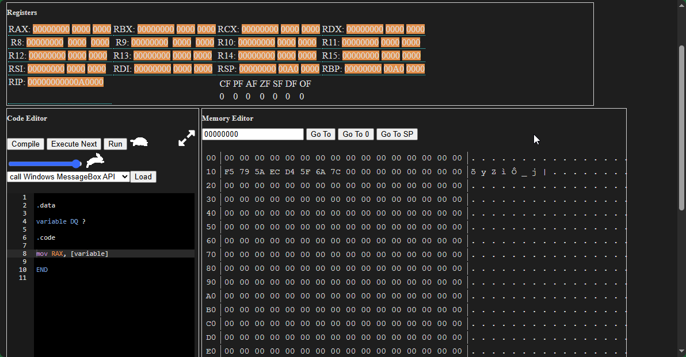
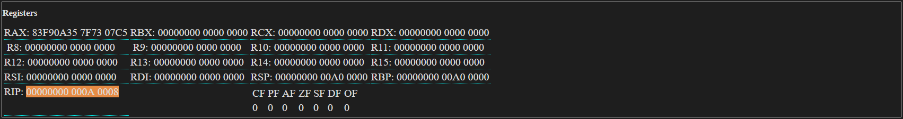

# x64Emu
A x64 assembly emulator (assembler + CPU) in TypeScript. [Try it live](https://fromthe.blue/x64Emu/index.html)


[video](ReadmeAttachments/runSample%20[x265].mp4)

This Interpreter and Emulator loads an assembly language program and executes it. Written using a modified version of [Long.js](https://github.com/dcodeIO/long.js) to handle working with 64-bit numbers in Javascript, which only handles 54 bit integer operations (The price of having no actual types).

This originally started out as a 16 bit emulator project in C# to run old school games. But as an added challenge I though what about web based? And I realized I didn't need to after discovering another person had already implemented exactly what I was looking for! [@otya128/winevdm](https://github.com/otya128/winevdm) so now I can play Civilization (1) for Windows at my leasure without a virtual machine *yay*
But being endlessly amazed by how machines work waaayyyyy down there still drags me back to projects like these... eventually.

#Features and limitations
Operands on instructions don't check for the correct number during compile. So if you have only one operand on, say, MOV the compiler doesn't care. But when running the program will die.
The emulator doesn't care about Memory, Memory operations. In the real world you can't call a "MOV mem, mem" as the processor can't handle memory to memory operations. My emulator will accept this as valid. Don't get into the habit of using this!
Instructions aren't stored in the virtual RAM. so you can't directly access, modify, or jump to code addresses at runtime. (Not that you should)
Not 100% certain all Instructions below are working esp. when it comes to assigning flags. I thing they are but I make no promises at this point.
Virtually no error handing. When an instruction isn't understood correctly the interpreter keeps going so ususally its at the end of stream that an error is thrown.
Like assembers be wary of assuming data sizes. Use BYTE, WORD, DWORD keywords for accessing memory locations or you might get weired results!
Floating point registers aren't implmented yet.

#Code Editor

[Ace code Editor](https://ace.c9.io/) for syntax highlighting
Highlights next instruction to be executed.
Clicking on the gutter will insert a breakpoint and the program will pause when it reaches that line.
During compile if a syntax error occurs the emulator will attempt to highlight the offending line.

#Registers

Shows the values in the registers.
Highlights the register that was modified by the last instruction.
Double clicking on the register value (Except RIP) will allow you to modify the register value.
Editing registers is divided into 3 parts. The Top 32 bits. The mid 16 bits (top half of E) and the lower 16 bits (X).
Input values must be in Hex (0-9 A-F) and case doesn't matter.
double clicking on a flag value allows it to be changed as well. Only accepts 1 or 0.

A: General Purpose Register
B: General Purpose Register
C: General Purpose Register
D: General Purpose Register
SI: General Purpose Register
DI: General Purpose Register
R8: General Purpose Register
R9: General Purpose Register
R10: General Purpose Register
R11: General Purpose Register
R12: General Purpose Register
R13: General Purpose Register
R14: General Purpose Register
R15: General Purpose Register

BP: Stack Base Pointer. Stack pointer grows towards 0 from here. Should always use 32 bit reference EBP whan using.
SP: Stack Pointer. Should always use 32 bit reference ESP whan using.

; IP: Points to the next instruction to be executed. Shouldn't be changed manually in code! (ie don't use "mov EIP, 0x10") Use the flow control instructions. (like JMP mylabel)

All Registers can be accessed at different sizes:
For instance usinging the "A" register the full 32 bits would be accessed using EAX
AX is used for accessing the lower 16 bits
AL for the lower byte (8 bits)
And finally AH for acessing the higher 8 bits of the lower 16 bits
As an example if we have the following hex number in the D register: 0x12345678
EDX would return the whole number (0x12345678)
DX would return 0x5678
DH would return 0x56
DL would return 0x78

For the extended R registers you can access lower bits using the following:
R8 - The full 64-bit register.
R8D - D for Double Word (Lower 32-bits)
R8W - W for Word (Lower 16-bits)
R8B - B for byte (Lowest 8-bits)
Notice the difference between the older registers and the newer R registers is there is no H option to get the lowest high byte (Like AH)

Segment registers DS, ES, FS, GS, SS are not used.
Flags
CF:	Operation generated a carry or borrow
PF:	Last byte has even number of 1's, else 0
AF:	Denotes Binary Coded Decimal in-byte carry
ZF:	Result was 0
SF:	Most significant bit of result is 1
DF:	Direction string instructions operate (increment or decrement)
OF:	Overflow on signed operation

#Memory View

Shows the values in memory
Can jump to different areas in memory.
Hightlights memory that was read by last instruction.
Highlights memory that was modified by last instruction.
Double clicking a cell will allow that byte in memory to be modified.
Declared variables in the .data section will start at address 0x10 (16) and will grow towards the end of memory
Instructions are stored at 0xA0000. Currently this is a lie and instructions aren't stored in emulator memory
Memory is hardcoded to be 0xA00000 bytes long. (10 Mebibytes... ugh Megabytes)
The stack starts at 0xA00000 and grows towards 0. The stack can trample other memory if it grows too large.

#Output View
When using int 0x21 the output window will appear. This allows for interrupts to emulate dos functions and read chars and write to the screen as though it were a console application.
Attempts to make look like a classic DOS screen.
When using int 0x4C with a value in AH of 0x1 or 0x7 or 0x8 the output view must be in focus (clicked on) for the emulator to receive input.

#Operators

+	Adds two values
-	Subtracts right from left
*	Multiplies
/	Divides (Integer Division)
MOD	Remainder of Integer Division
EQ	Equality chack
NE	Not Equal to
GT	Greater than
LT	Less than
GE	Greater than or equal to
LE	Less than or equal to
AND	Bitwise AND
OR	Bitwise OR
XOR	Bitwise XOR
NOT	Bitwise NOT
SHL	Bitwise Shift bits left
SHR	Bitwise Shift bits right
LENGTH	Gets the length (in bytes) of the defined variable.
Eg.
 .data
   msg db 'Hello $' ; 7 Letters long
 .code
   mov eax, LENGTH msg ; Puts 7 into EAX
 	
[ and ]	Used to get the contents at calcualted memory address of the operation within the parenthesis.

#Keywords

.CODE	Tells the compiler the next section is code. REQUIRED
.DATA	Tells the compiler the next section is data.
BYTE	Tells the next instruction the value is byte sized.
WORD	Tells the next instruction the value is 2 bytes (Short).
DWORD	Tells the next instruction the value is 4 bytes (An Int).
DB	Used in .data to declare variable size of byte.
DW	Used in .data to declare variable size of word (Short). 2-bytes
DD	Used in .data to declare variable size of dword (Int). 4-bytes
DQ	Used in .data to declare variable size of qword (long) (8 bytes).
DUP	Used in .data to duplicate data during declaration.
What that means is lets say we have:
data db 0, 0, 0, 0
We can declare this using the dup command:
data db 4 DUP (0)
Which tells the compiler to put 0 valued byte into the data variable 4 times.
This is really useful when you have a large buffer for instance:
buffer db 80 DUP (0)
Will tell the compiler to fill the buffer variable with 80 bytes of zero.

Format:
<Variable Name> <Data Size (DB, DW, D, or DQ)> <Num of times to duplicate> DUP (<Value>)
<Value> can be any value that fits into the data size. As well at multipule values comma seperated:
data db 4 DUP (0, 1)
Is the same as:
data db 0, 1, 0, 1, 0, 1, 0, 1
END	End program.
EXTRN	Points to an external function that should be included. See External Functions

Implemented Instructions

Most instructions have two parameters (operands) Target and Source.
When an operation is performed the source and target are read and the operation does what it needs to before placing the result in the Target overwriting what was there. Source remains unchanged.
A good example would be this:
```
MOV ax, 4 ; Move 4 into ax
MOV bx, 3 ; Move 3 into bx
ADD ax, bx ; Read 3 from bx and read 4 from ax. Add the two numbers together and place in ax (result 7).
```
There are a few that just perform an operation using a single operand (Like INC that adds one to the Target) and a few that can use more than two operands.
For operations Target Can be a Register or Memory Location. Source can be a Register, Memory Location, or Immidiate value (a number). Source and target cannot both be a memory location.
This list also includes instructions which are specifically not available to use here. Namely instructions that have been replaced in x64 or that involve privileged operations or threading.
I'm still working on adding documentation and examples to this section.

 | AAA | AAD | AAM | AAS | ADC | ADD | AND | ARPL |  | BOUND | BSF | BSR | BSWAP | BT | BTR | BTS |  | 
 | CALL | CALLF | CBW | CDQE | CDQ | CLAC | CLC | CLD |  | CLI | CLTS | CMC | CMOVA | CMOVAE | CMOVB | CMOVBE | CMOVC | 
 | CMOVE | CMOVG | CMOVGE | CMOVL | CMOVLE | CMOVNA | CMOVNAE | CMOVNB |  | CMOVNBE | CMOVNC | CMOVNE | CMOVNG | CMOVNGE | CMOVNL | CMOVNLE | CMOVNO | 
 | CMOVNP | CMOVNS | CMOVNZ | CMOVO | CMOVP | CMOVPE | CMOVPO | CMOVS |  | CMOVZ | CMP | CMPS | CMPSB | CMPSW | CMPSD | CMPSQ | CMPXCHG | 
 | CMPXCHG16B | CMPXCHG8B | CPUID | CQO | CWD | CWDE | DAA | DAS |  | DEC | DIV | END | ENTER | FWAIT | IDIV | IMUL | INC | 
 | INS | INSB | INSW | INSD | INT | INT1 | INTO | INVD | INVLPG |  | JA | JAE | JB | JBE | JC | JE | JECXZ | JG | 
 | JGE | JL | JLE | JMP | JMPF | JNA | JNAE | JNB |  | JNBE | JNC | JNE | JNG | JNGE | JNL | JNLE | JNO | 
 | JNP | JNS | JNZ | JO | JP | JPE | JPO | JCXZ |  | JS | JZ | HLT | LAHF | LAR | LDS | LEA | LEAVE | 
 | LES | LFS | LGDT | LGS | LIDT | LLDT | LMSW | LOCK |  | LODS | LODSB | LODSW | LODSD | LODSQ | LOOP | LOOPE | LOOPNE | 
 | LOOPNZ | LOOPZ | LSL | LSS | LTR | MOV | MOVS | MOVSB |  | MOVSW | MOVSD | MOVSQ | MUL | NEG | NOP | NOT | OR | 
 | OUTS | OUTSB | OUTSD | OUTSW | POP | POPA | POPAD | POPF |  | POPFD | POPFQ | PUSH | PUSHA | PUSHAD | PUSHF | PUSHFD | PUSHFQ | 
 | RCL | RCR | REP | REPE | REPNE | REPNZ | REPZ | RET |  | RETF | RETN | ROL | ROR | SAHF | SAL | SAR | SBB | 
 | SCAS | SCASB | SCASD | SCASQ | SCASW | SETA | SETAE | SETB |  | SETBE | SETC | SETE | SETG | SETGE | SETL | SETLE | SETNA | 
 | SETNAE | SETNB | SETNBE | SETNC | SETNE | SETNG | SETNGE | SETNL |  | SETNLE | SETNO | SETNP | SETNS | SETNZ | SETO | SETP | SETPE | 
 | SETPO | SETS | SETZ | SGDT | SHL | SHR | SIDT | SLDT |  | SMSW | STAC | STC | STD | STI | STOS | STOSB | STOSW | 
 | STOSD | STOSQ | STR | SUB | TEST | VERR | VERW | WAIT |  | WBINVD | XCHG | XOR | 

#Implemented Interrupts:

+ 0x05	Print Screen
+ 0x10	Video Interrupts	None Implemented at the moment.
+ 0x13	Disk Operations  (Not Implemented at the moment.)	
  Value of AH	
  + 0x0	DISK - RESET DISK SYSTEM
  + 0x1	DISK - GET STATUS OF LAST OPERATION
  + 0x2	DISK - READ SECTOR(S) INTO MEMORY
  + 0x3	DISK - WRITE DISK SECTOR(S)
  + 0x4	DISK - VERIFY DISK SECTOR(S)
  + 0x18	DISKLESS BOOT HOOK - Called when a boot loader can't find the OS.
    Terminates the running program.
+ 0x21	DOS Software Interrupt	0x4C
  Value of AH	
    + 0x0	Program terminate.
    + 0x1	Character input
      Waits for a key to be pressed and then sets AL to the pressed key.
      Echos the pressed key to the screen.
    + 0x02	Character output. Gets character from DL and writes to screen.
    + 0x07	Direct console input without echo
      Waits for a key to be pressed and then sets AL to the pressed key.
    + 0x08	Console input without echo
      Waits for a key to be pressed and then sets AL to the pressed key.
      The key is also echoed to the screen.
    + 0x09	Display string
      Gets memory address from DX and reads a string from memory. The string must be terminated by a $ character.

#Implemented External APIS (Win API):

Handles System Calls from program.
64-Bit Calls to windows functions:
[Microsoft x64 calling convention](https://en.wikipedia.org/wiki/X86_calling_conventions#Microsoft_x64_calling_convention)
Registers RCX, RDX, R8, R9 for the first four integer or pointer arguments (in that order)
Additional arguments are pushed onto the stack (right to left)
Return values placed in EAX
[wikipedia stdcall](https://en.wikipedia.org/wiki/X86_calling_conventions#stdcall)
MessageBoxA	int MessageBoxA(HWND hWnd, LPCSTR lpText, LPCSTR lpCaption, UINT uType);
ExitProcess	void ExitProcess(); - Ends the program execution. Does not return.


#Unimplemented Instructions
The following is a list of instructions that aren't implmeneted as of yet.
Sweet jesus that's a long list :-S
 | ADCX | ADDPD | ADDPS | ADDSD | ADDSS | ADDSUBPD | ADDSUBPS | ADOX |  | AESDEC | AESDECLAST | AESENC | AESENCLAST | AESIMC | AESKEYGENASSIST | ANDN | ANDNPD | 
 | ANDNPS | ANDPD | ANDPS | BEXTR | BLENDPD | BLENDPS | BLENDVPD | BLENDVPS |  | BLSI | BLSMSK | BLSR | BNDCL | BNDCN | BNDCU | BNDLDX | BNDMK | 
 | BNDMOV | BNDSTX | BTC | BZHI | CLDEMOTE | CLFLUSH | CLFLUSHOPT | CLWB |  | CMPPD | CMPPS | CMPSS | COMISD | COMISS | CRC32 | CVTDQ2PD | CVTDQ2PS | 
 | CVTPD2DQ | CVTPD2PI | CVTPD2PS | CVTPI2PD | CVTPI2PS | CVTPS2DQ | CVTPS2PD | CVTPS2PI |  | CVTSD2SI | CVTSD2SS | CVTSI2SD | CVTSI2SS | CVTSS2SD | CVTSS2SI | CVTTPD2DQ | CVTTPD2PI | 
 | CVTTPS2DQ | CVTTPS2PI | CVTTSD2SI | CVTTSS2SI | DIVPD | DIVPS | DIVSD | DIVSS |  | DPPD | DPPS | EMMS | EXTRACTPS | F2XM1 | FABS | FADD | FADDP | 
 | FBLD | FBSTP | FCHS | FCLEX | FCMOVcc | FCOM | FCOMI | FCOMIP |  | FCOMP | FCOMPP | FCOS | FDECSTP | FDIV | FDIVP | FDIVR | FDIVRP | 
 | FFREE | FIADD | FICOM | FICOMP | FIDIV | FIDIVR | FILD | FIMUL |  | FINCSTP | FINIT | FIST | FISTP | FISTTP | FISUB | FISUBR | FLD | 
 | FLD1 | FLDCW | FLDENV | FLDL2E | FLDL2T | FLDLG2 | FLDLN2 | FLDPI |  | FLDZ | FMUL | FMULP | FNCLEX | FNINIT | FNOP | FNSAVE | FNSTCW | 
 | FNSTENV | FNSTSW | FPATAN | FPREM | FPREM1 | FPTAN | FRNDINT | FRSTOR |  | FSAVE | FSCALE | FSIN | FSINCOS | FSQRT | FST | FSTCW | FSTENV | 
 | FSTP | FSTSW | FSUB | FSUBP | FSUBR | FSUBRP | FTST | FUCOM |  | FUCOMI | FUCOMIP | FUCOMP | FUCOMPP | FXAM | FXCH | FXRSTOR | FXSAVE | 
 | FXTRACT | FYL2X | FYL2XP1 | GF2P8AFFINEINVQB | GF2P8AFFINEQB | GF2P8MULB | HADDPD | HADDPS |  | HSUBPD | HSUBPS | IN | INSERTPS | INT3 | INVPCID | IRET | IRETD | 
 | KADDB | KADDD | KADDQ | KADDW | KANDB | KANDD | KANDNB | KANDND |  | KANDNQ | KANDNW | KANDQ | KANDW | KMOVB | KMOVD | KMOVQ | KMOVW | 
 | KNOTB | KNOTD | KNOTQ | KNOTW | KORB | KORD | KORQ | KORW |  | KORTESTB | KORTESTD | KORTESTQ | KORTESTW | KORW | KSHIFTLB | KSHIFTLD | KSHIFTLQ | 
 | KSHIFTLW | KSHIFTRB | KSHIFTRD | KSHIFTRQ | KSHIFTRW | KTESTB | KTESTD | KTESTQ |  | KTESTW | KUNPCKBW | KUNPCKDQ | KUNPCKWD | KXNORB | KXNORD | KXNORQ | KXNORW | KXORB | 
 | KXORD | KXORQ | KXORW | LDDQU | LDMXCSR | LZCNT | MASKMOVDQU | MASKMOVQ |  | MAXPD | MAXPS | MAXSD | MAXSS | MFENCE | MINPD | MINPS | MINSD | 
 | MINSS | MONITOR | MOVAPD | MOVAPS | MOVBE | MOVD | MOVDDUP | MOVDIR64B |  | MOVDIRI | MOVDQ2Q | MOVDQA | MOVDQU | MOVHLPS | MOVHPD | MOVHPS | MOVLHPS | 
 | MOVLPD | MOVLPS | MOVMSKPD | MOVMSKPS | MOVNTDQ | MOVNTDQA | MOVNTI | MOVNTPD |  | MOVNTPS | MOVNTQ | MOVQ | MOVQ (1) | MOVQ2DQ | MOVSHDUP | MOVSLDUP | MOVSS | 
 | MOVSX | MOVSXD | MOVUPD | MOVUPS | MOVZX | MPSADBW | MULPD | MULPS |  | MULSD | MULSS | MULX | MWAIT | ORPD | ORPS | OUT | PABSB | 
 | PABSD | PABSQ | PABSW | PACKSSDW | PACKSSWB | PACKUSDW | PACKUSWB | PADDB |  | PADDD | PADDQ | PADDW | PADDSB | PADDSW | PADDUSB | PADDUSW | PALIGNR | 
 | PAND | PANDN | PAUSE | PAVGB | PAVGW | PBLENDVB | PBLENDW | PCLMULQDQ |  | PCMPEQB | PCMPEQD | PCMPEQQ | PCMPEQW | PCMPESTRI | PCMPESTRM | PCMPGTB | PCMPGTD | 
 | PCMPGTQ | PCMPGTW | PCMPISTRI | PCMPISTRM | PDEP | PEXT | PEXTRB | PEXTRD |  | PEXTRQ | PEXTRW | PHADDD | PHADDSW | PHADDW | PHMINPOSUW | PHSUBD | PHSUBSW | 
 | PHSUBW | PINSRB | PINSRD | PINSRQ | PINSRW | PMADDUBSW | PMADDWD | PMAXSB |  | PMAXSD | PMAXSQ | PMAXSW | PMAXUB| PMAXUD | PMAXUQ | PMAXUW | PMINSB | 
 | PMINSD | PMINSQ | PMINSW | PMINUB | PMINUD | PMINUQ | PMINUW | PMOVMSKB |  | PMOVSX | PMOVZX | PMULDQ | PMULHRSW | PMULHUW | PMULHW | PMULLD | PMULLQ | 
 | PMULLW | PMULUDQ | POPCNT | POR | PREFETCHW | PREFETCHh | PSADBW| PSHUFB |  | PSHUFD | PSHUFHW | PSHUFLW | PSHUFW | PSIGNB | PSIGND | PSIGNW | PSLLD | 
 | PSLLDQ | PSLLQ | PSLLW | PSRAD | PSRAQ | PSRAW | PSRLD | PSRLDQ |  | PSRLQ | PSRLW | PSUBB | PSUBD | PSUBQ | PSUBSB | PSUBSW | PSUBUSB | 
 | PSUBUSW | PSUBW | PTEST | PTWRITE | PUNPCKHBW | PUNPCKHDQ | PUNPCKHQDQ | PUNPCKHWD |  | PUNPCKLBW | PUNPCKLDQ | PUNPCKLQDQ | PUNPCKLWD | PXOR| RCPPS | RCPSS | RDFSBASE | 
 | RDGSBASE | RDMSR | RDPID | RDPKRU | RDPMC | RDRAND | RDSEED | RDTSC |  | RDTSCP | RORX | ROUNDPD | ROUNDPS | ROUNDSD | ROUNDSS | RSM | RSQRTPS | 
 | RSQRTSS | SARX | SFENCE | SHA1MSG1 | SHA1MSG2 | SHA1NEXTE | SHA1RNDS4 | SHA256MSG1 |  | SHA256MSG2 | SHA256RNDS2 | SHLD | SHLX | SHRD | SHRX | SHUFPD | SHUFPS | 
 | SQRTPD | SQRTPS | SQRTSD | SQRTSS | STMXCSR | SUBPD | SUBPS | SUBSD |  | SUBSS | SWAPGS | SYSCALL | SYSENTER | SYSEXIT | SYSRET | TPAUSE | TZCNT | 
 | UCOMISD | UCOMISS | UD | UMONITOR | UMWAIT | UNPCKHPD | UNPCKHPS | UNPCKLPD |  | UNPCKLPS | VALIGND | VALIGNQ | VBLENDMPD | VBLENDMPS | VBROADCAST | VCOMPRESSPD | VCOMPRESSPS | 
 | VCVTPD2QQ | VCVTPD2UDQ | VCVTPD2UQQ | VCVTPH2PS | VCVTPS2PH | VCVTPS2QQ | VCVTPS2UDQ | VCVTPS2UQQ |  | VCVTQQ2PD | VCVTQQ2PS | VCVTSD2USI | VCVTSS2USI | VCVTTPD2QQ | VCVTTPD2UDQ | VCVTTPD2UQQ | VCVTTPS2QQ | 
 | VCVTTPS2UDQ | VCVTTPS2UQQ | VCVTTSD2USI | VCVTTSS2USI | VCVTUDQ2PD | VCVTUDQ2PS | VCVTUQQ2PD | VCVTUQQ2PS |  | VCVTUSI2SD | VCVTUSI2SS | VDBPSADBW | VEXPANDPD | VEXPANDPS | VEXTRACTF128 | VEXTRACTF32x4 | VEXTRACTF32x8 |  | VEXTRACTF64x2 | VEXTRACTF64x4 | VEXTRACTI128 | VEXTRACTI32x4 | VEXTRACTI32x8 | VEXTRACTI64x2 | VEXTRACTI64x4 | VFIXUPIMMPD | 
 | VFIXUPIMMPS | VFIXUPIMMSD | VFIXUPIMMSS | VFMADD132PD | VFMADD132PS | VFMADD132SD | VFMADD132SS | VFMADD213PD |  | VFMADD213PS | VFMADD213SD | VFMADD213SS | VFMADD231PD | VFMADD231PS | VFMADD231SD | VFMADD231SS | VFMADDSUB132PD |  | VFMADDSUB132PS | VFMADDSUB213PD | VFMADDSUB213PS | VFMADDSUB231PD | VFMADDSUB231PS | VFMSUB132PD | VFMSUB132PS | VFMSUB132SD | 
 | VFMSUB132SS | VFMSUB213PD | VFMSUB213PS | VFMSUB213SD | VFMSUB213SS | VFMSUB231PD | VFMSUB231PS | VFMSUB231SD |  | VFMSUB231SS | VFMSUBADD132PD | VFMSUBADD132PS | VFMSUBADD213PD | VFMSUBADD213PS | VFMSUBADD231PD | VFMSUBADD231PS | VFNMADD132PD |  | VFNMADD132PS | VFNMADD132SD | VFNMADD132SS | VFNMADD213PD | VFNMADD213PS | VFNMADD213SD | VFNMADD213SS | VFNMADD231PD | 
 | VFNMADD231PS | VFNMADD231SD | VFNMADD231SS | VFNMSUB132PD | VFNMSUB132PS | VFNMSUB132SD | VFNMSUB132SS | VFNMSUB213PD |  | VFNMSUB213PS | VFNMSUB213SD | VFNMSUB213SS | VFNMSUB231PD | VFNMSUB231PS | VFNMSUB231SD | VFNMSUB231SS | VFPCLASSPD |  | VFPCLASSPS | VFPCLASSSD | VFPCLASSSS | VGATHERDPD | VGATHERDPD (1) | VGATHERDPS | VGATHERDPS (1) | VGATHERQPD | 
 | VGATHERQPD (1) | VGATHERQPS | VGATHERQPS (1) | VGETEXPPD | VGETEXPPS | VGETEXPSD | VGETEXPSS | VGETMANTPD |  | VGETMANTPS | VGETMANTSD | VGETMANTSS | VINSERTF128 | VINSERTF32x4 | VINSERTF32x8 | VINSERTF64x2 | VINSERTF64x4 |  | VINSERTI128 | VINSERTI32x4 | VINSERTI32x8 | VINSERTI64x2 | VINSERTI64x4 | VMASKMOV | VMOVDQA32 | VMOVDQA64 | 
 | VMOVDQU16 | VMOVDQU32 | VMOVDQU64 | VMOVDQU8 | VPBLENDD | VPBLENDMB | VPBLENDMD | VPBLENDMQ |  | VPBLENDMW | VPBROADCAST | VPBROADCASTB | VPBROADCASTD | VPBROADCASTM | VPBROADCASTQ | VPBROADCASTW | VPCMPB | 
 | VPCMPD | VPCMPQ | VPCMPUB | VPCMPUD | VPCMPUQ | VPCMPUW | VPCMPW | VPCOMPRESSD |  | VPCOMPRESSQ | VPCONFLICTD | VPCONFLICTQ | VPERM2F128 | VPERM2I128 | VPERMB | VPERMD | VPERMI2B | 
 | VPERMI2D | VPERMI2PD | VPERMI2PS | VPERMI2Q | VPERMI2W | VPERMILPD | VPERMILPS | VPERMPD |  | VPERMPS | VPERMQ | VPERMT2B | VPERMT2D | VPERMT2PD | VPERMT2PS | VPERMT2Q | VPERMT2W | 
 | VPERMW | VPEXPANDD | VPEXPANDQ | VPGATHERDD | VPGATHERDD (1) | VPGATHERDQ | VPGATHERDQ (1) | VPGATHERQD |  | VPGATHERQD (1) | VPGATHERQQ | VPGATHERQQ (1) | VPLZCNTD | VPLZCNTQ | VPMADD52HUQ | VPMADD52LUQ | VPMASKMOV |  | VPMOVB2M | VPMOVD2M | VPMOVDB | VPMOVDW | VPMOVM2B | VPMOVM2D | VPMOVM2Q | VPMOVM2W | 
 | VPMOVQ2M | VPMOVQB | VPMOVQD | VPMOVQW | VPMOVSDB | VPMOVSDW | VPMOVSQB | VPMOVSQD |  | VPMOVSQW | VPMOVSWB | VPMOVUSDB | VPMOVUSDW | VPMOVUSQB | VPMOVUSQD | VPMOVUSQW | VPMOVUSWB | 
 | VPMOVW2M | VPMOVWB | VPMULTISHIFTQB | VPROLD | VPROLQ | VPROLVD | VPROLVQ | VPRORD |  | VPRORQ | VPRORVD | VPRORVQ | VPSCATTERDD | VPSCATTERDQ | VPSCATTERQD | VPSCATTERQQ | VPSLLVD | 
 | VPSLLVQ | VPSLLVW | VPSRAVD | VPSRAVQ | VPSRAVW | VPSRLVD | VPSRLVQ | VPSRLVW |  | VPTERNLOGD | VPTERNLOGQ | VPTESTMB | VPTESTMD | VPTESTMQ | VPTESTMW | VPTESTNMB | VPTESTNMD | 
 | VPTESTNMQ | VPTESTNMW | VRANGEPD | VRANGEPS | VRANGESD | VRANGESS | VRCP14PD | VRCP14PS |  | VRCP14SD | VRCP14SS | VREDUCEPD | VREDUCEPS | VREDUCESD | VREDUCESS | VRNDSCALEPD | VRNDSCALEPS | 
 | VRNDSCALESD | VRNDSCALESS | VRSQRT14PD | VRSQRT14PS | VRSQRT14SD | VRSQRT14SS | VSCALEFPD | VSCALEFPS |  | VSCALEFSD | VSCALEFSS | VSCATTERDPD | VSCATTERDPS | VSCATTERQPD | VSCATTERQPS | VSHUFF32x4 | VSHUFF64x2 | 
 | VSHUFI32x4 | VSHUFI64x2 | VTESTPD | VTESTPS | VZEROALL | VZEROUPPER | WRFSBASE | WRGSBASE |  | WRMSR | WRPKRU | XABORT | XACQUIRE | XADD | XBEGIN | XEND | XGETBV | 
 | XLAT | XLATB | XORPD | XORPS | XRELEASE | XRSTOR | XRSTORS | XSAVE |  | XSAVEC | XSAVEOPT | XSAVES | XSETBV | XTEST | 
